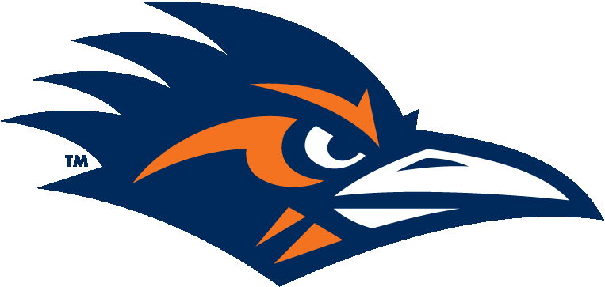

# RowdyHunter

This is the Final Project in cs 3443 Application Programming. Our group project is to re-create the Nintendo NES game Duck Hunt
but re-theme it with our schools mascot; Rowdy the Roadrunner. Our goal is to closely mirror Duck Hunt while adding a couple of twists to it for a more "modern" feel.

Instructions:   
              Set your username and click play. If you need more instructions click the word bubble over the grey alien for                   some help. Shoot the ufo as many times as possible within a set amount of magazines. shoot with left mouse button               and reload with right mouse button.  

Group Members:   
                Ariel Guerrero - leader; Email: arielguerrero1012@gmail.com   
                Efrael Gonzalez  
                Kyle Evers <- inactive member   
                Isaiah Hernandez  
                Joshua McFall  
                Phillip Carroll  
                Quevin Cams

