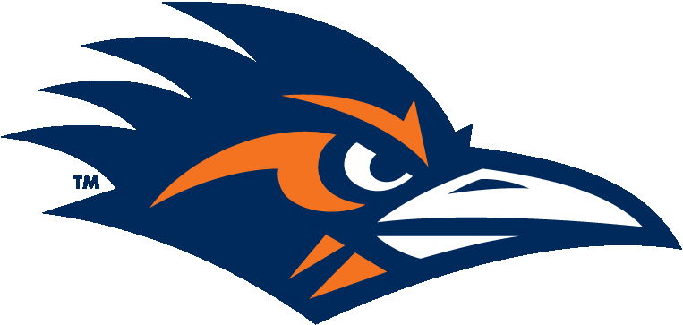

# RowdyHunter

This is the Final Project in cs 3443 Application Programming. Our group project is to re-create the Nintendo NES game Duck Hunt
but re-theme it with our schools mascot; Rowdy the Roadrunner. Our goal is to closely mirror Duck Hunt while adding a couple of twists to it for a more "modern" feel.

Group Members:   
Ariel Guerrero - leader; Email: arielguerrero1012@gmail.com   
Efrael Gonzalez  
Kyle Evers  
Isaiah Hernandez  
Joshua McFall  
Phillip Carroll  
Quevin Cams

